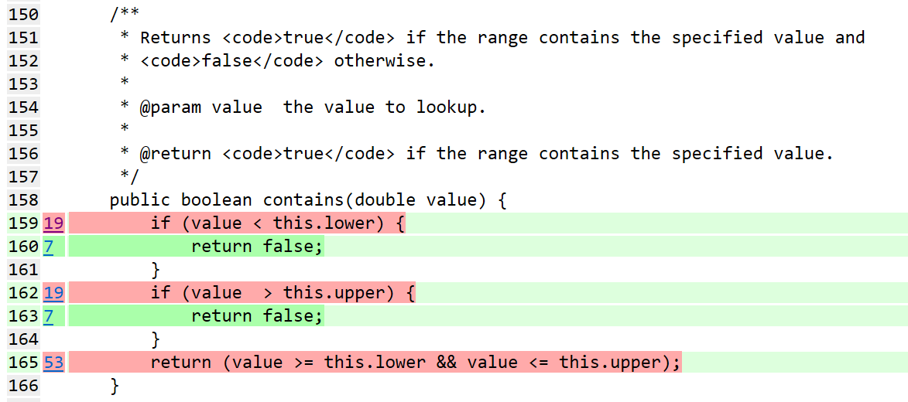
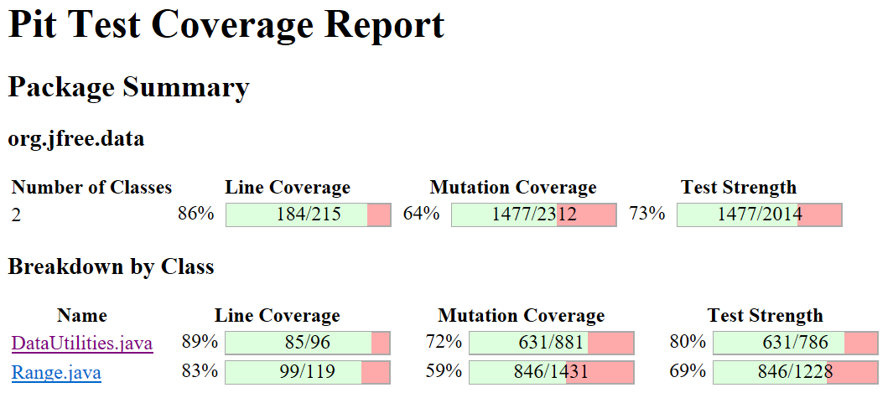
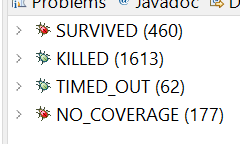
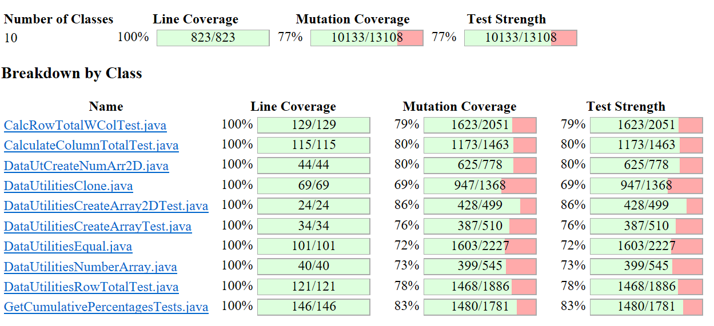
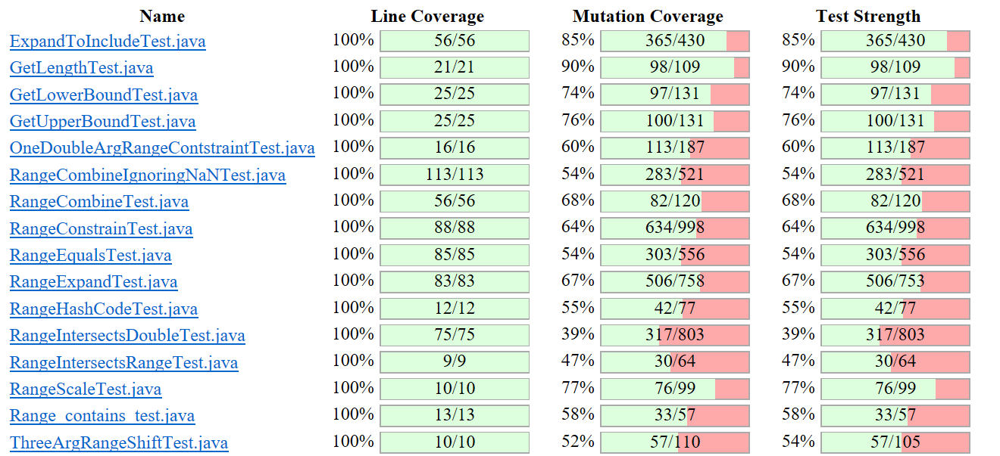
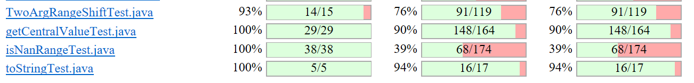
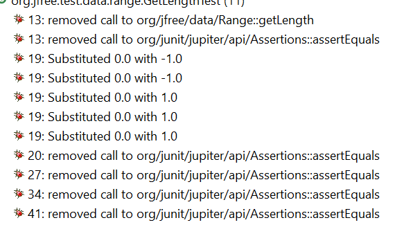
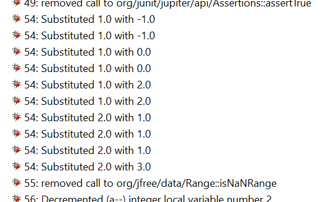
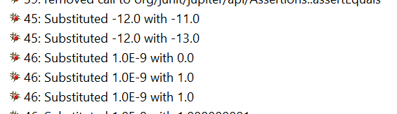
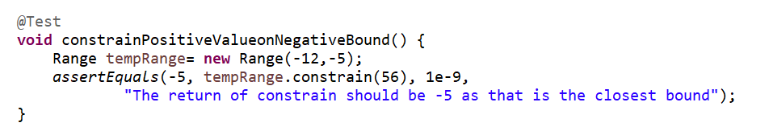

**SENG 438 - Software Testing, Reliability, and Quality**

**Lab. Report \#4 – Mutation Testing and Web app testing**

| Group \#: 4     |     |
| -------------- | --- |
| Student Names:
| Adol Awan | |
Lex Brexowski              |     |
 Uchenna Osemeka             |     |
Sam Shojaei  
Jane Zhang|     |

# Introduction
This lab focused on evaluating the effectiveness of test cases, with particular emphasis on mutation testing using the PITest tool. By analyzing generated mutants, we examined why certain mutants were killed while others survived, allowing us to identify weaknesses in our existing test suite. This process guided the development of more robust and targeted test cases aimed at improving fault detection.

An important observation from this analysis was that simply increasing the number of test cases does not necessarily lead to better testing outcomes. In some instances, additional tests introduced more mutations without significantly improving the ability to detect faults. As a result, the lab emphasized the importance of designing effective test cases rather than relying on quantity alone.

The lab also introduced GUI testing, where we learned how to automate test execution. This required careful validation to ensure that automated tests performed the intended actions correctly. Checkpoints were used within test cases to verify expected behaviors and outcomes during execution.

Overall, the lab highlighted the importance of test effectiveness, encouraging a deeper understanding of how and why tests detect (or fail to detect) faults, rather than focusing solely on the number of test cases.

# Analysis of 10 Mutants of the Range class 

**Mutation 1: Range.contains Early Exits**

Line 159 and 162 have similar mutation problems. Both of the checks are early exit checks that speed up the code, however they are effectively redundant due to line 165. Even if line 159, 162, or both are set to false, the condition is still caught correctly by line 165. There isn't a way to modify the test cases to catch these mutations, instead lines 159-164 of the contains method should be removed.

**Mutation 2: Range.contains Value Check**

Mutations #2, #6, #14, #19, #22, #25, #27 all show NO_COVERAGE, meaning no test ever reaches line 165 at all. This is because tests with values below/above the range are stopped early by lines 159–163, and they never fall through to line 165. The only way to hit line 165 is with a value inside the range, but your inside-range tests all return true, so mutations like "replaced boolean return with true" trivially pass. To fix this, we need tests that reach line 165 and expect false, but as explained in Mutation 1, that's structurally impossible because line 165 always computes the correct answer.

**Mutation 3: Range.TwoArgsRangeShift**

Mutations in shift(base, delta) survive mainly because the two argument version always calls shift(base, delta, false), so constant changes around line 371 still behave the same for the tested inputs and are not observable in the final result. In addition, many mutants around lines 388–416 show NO_COVERAGE because these tests never execute the allowZeroCrossing == true path, so only the no zero crossing branch is exercised while the alternative branch remains completely untested.

**Mutation 4: Range.TwoArgsRangeShift**

Another issue appears at lines 409–410 in shiftWithNoZeroCrossing(). Many mutations there survive because the current tests only use a limited set of positive value cases, so changes around the value > 0.0 check and Math.max(value + delta, 0.0) still produce the same output and cannot be distinguished by the assertions.

**Mutation 5: Range.TwoArgsRangeShift**

From the screenshot, the mutants in the positive and negative branches were killed (green), while the mutant in the else branch (red) survived. After analysing the code, this was due to the absence of a test case for the scenario where value == 0.0. Since this branch was not exercised, mutations affecting it were not detected. A new test case was therefore added to cover the zero-value condition and improve mutation coverage.

**Mutation 6: Range.**

After analysing the constructor and the RangeConstrainTest test class, it was found that the exception branch in the constructor was not executed because all test cases used valid range inputs. For example, new Range(5, 13) and new Range(-12, -5) both satisfy the condition lower <= upper, so the branch if (lower > upper) is never entered. As a result, the statement that throws IllegalArgumentException was not tested, allowing the mutant in that section to survive. To cover this branch, a separate test case should be added using an invalid range where the lower bound is greater than the upper bound.
# Report all the statistics and the mutation score for each test class

**Before**

**After**

# Analysis drawn on the effectiveness of each of the test classes
To avoid repetition, please see the select few methods in Range class to be used to showcase the analysis drawn from all test classes.

**GetLengthTest**

The test class demonstrates high effectiveness. It successfully killed 90% of the mutants, indicating that it is strong in detecting faults. Looking at the PIT Mutations summary, it shows that 11 of the mutants survived, suggesting that certain behaviors are not fully tested. However, upon closer inspection, 5 of the mutants involve removing the assertions line in the test case. As such, it is impossible to kill these mutants because the test case will do nothing. Overall, the test cases are effective in catching most faults.

**isNanRangeTest**

As can be seen in the image, the test cases have low effectiveness. The test class successfully killed only 39% of the mutants, indicating that it is limited in detecting faults. Many of the surviving mutations are due to the deletion of the assertion line which cannot be killed. Overall, this test class need improvement by increasing input variation such as including negative values or improving the quality of each individual test case.

**RangeConstrainTest**

 

From the image, this test class demonstrates moderate effectiveness. The test class successfully killed just over half of the mutants, indicating that it is adequate in detecting faults.
However, under half of the mutants survived, suggesting that many of the behaviors are not fully tested. When you look closer at the mutants that did survive, some are not killable. Take a look at the second image listed. If the given value is 56, then no matter what you change the tempRange lowerbound to (-12, -11, -13, etc.), the closest bound will always be the lower bound. Hence, the behaviour does not change and therefore such mutants survive no matter the condition.

# A discussion on the effect of equivalent mutants on mutation score accuracy
Equivalent mutants make it harder to fulfill the core purpose of mutation score accuracy, which is to see how good or bad our tests are. Because these equivalent mutants exist and survive, it becomes harder to report an accurate picture of our testing suite to outside parties, as at a glance, a score that looks low could just be held back by equivalence and there's no way to easily tell without digging deeper. 

It adds amibiguity to mutation score accuracy, and extra burden to the tester who has to see if a surviving mutant is just equivalent or truly an indicator of missing test coverage.

- Equivalent mutants could be found by finding redundant early exits that are redundant in code (mutations 1 and 2 above)

# A discussion of what could have been done to improve the mutation score of the test suites
To improve the mutation score you simply have to make more tests to catch the changes in source code caused by mutations. We ran the mutation test with PIT, observed the mutants that survived, and designed test cases to catch those.

As part of that we analyzed the context and type of surviving mutation to rule out equivalency, and then looked at the source code to see how that mutation affected the logic. We then looked to our tests to see what we're missing and add where we can. When that's done we run again, and see if we successfully caught the mutation.

# Why do we need mutation testing? Advantages and disadvantages of mutation testing
Designing test cases for various functionalities in software always raises the question of how many tests are needed in a test suite to ensure good coverage of any faults in the code. Using various BB or WB testing methods, it can effectively solve the number of tests needed. However, it does not verify the testing quality. Mutation testing takes it to the next level by checking the quality of the existing test cases. Mutation testing introduces synthetic bugs, known as "mutants", into the program to purposely create faulty versions that will exhibit different behaviour. An example of this is if there is a condition (x < 20), and the mutant would change the condition to (x <= 20) and check what happens. If the test case fails as a result, then the mutant is killed. If the behavior does not have an observable change, then the mutant survives. This process helps identify weak test cases, or test suites that need improvement.

Advantages:
- Mutation testing is an automatic process
- It tests the quality of the design of the test suite
- Helps find missing test cases that may have been missed during the manual testing phase (e.g. missing edge or boundary test cases)
- The mutatation score is another method of evaluation to know when there is enough testing

Disadvantages:
- It is computationally intensive due to the large number of mutants that must be iterated through for each test case
- Equivalenet mutants can't be killed, hence it is difficult to have 100% coverage
- Many mutants are not practical for real behaviour. For example, "removing the assert()" line in a test case is not helpful as it doesn't show any potential faults in the code
- Mutation testing does not cover the quality of the code written. If there are any unaccessible lines of code in the original class, these will sit in the "No Coverage" portion and is not included in the mutation score.

# Explain your SELENUIM test case design process

Test cases were designed by recording real user interactions directly in the Selenium IDE browser extension.
1. Identify the scenario to test. Each test targets one specific user action such as switching languages or signing up with a new phone number. Keeping each test focused on a single behaviour makes it easier to pinpoint what broke if a test fails.
2. Record the user flow. Using Selenium IDE's record button, each test was created by simply performing the actions in the browser, such as clicking buttons, typing into fields, and hovering over elements. Selenium IDE captured every interaction automatically as a sequence of commands.
3. Add assertions. After recording, assertions were manually inserted at the end of each test to verify the expected outcome actually occurred. This is what turns a recording into a real test.
4. Replay and verify. Each test was replayed using the IDE's run button to confirm it passes before saving.

# Explain the use of assertions and checkpoints

Assertions are the most important part of our testcases as they determine whether the test passes or fails. Without an assertion, Selenium IDE would just click through the steps and call it a success even if the wrong page loaded or nothing worked correctly.

For example, assertTitle checks the title of the browser tab after an action is performed. It is useful for confirming that a page navigation or significant UI change actually took effect, since the page title typically updates to reflect where the user is. If the expected change did not occur, the title will not match and the test will fail.

Checkpoints ensure that the tests are not just going through the motions, instead they are confirming the application behaved correctly.

# how did you test each functionaity with different test data

In general, the process is as follows:
- If the method involved lower and upper bounds, normal cases included valid inputs to ensure objects were created correctly. Edge cases, such as where both bounds were equal (e.g., lower = upper) or when the value = lower bound, were tested to verify valid boundary behavior. Invalid cases were also tested to confirm that an IllegalArgumentException is thrown. These tests ensure that the code enforces correct range constraints.
- If the method involved the behaviours of introducing null or invalid inputs, these were tested using different combinations of null and non-null inputs. Normal cases included two valid inputs to verify correct output. Edge cases included one or both being null to ensure proper handling. These tests confirm that the method correctly handles null inputs.
- Additional test cases may involve including a negative value to check if the test case behaves differently

# Discuss advantages and disadvantages of Selenium vs. Sikulix
Selenium and Sikulix are both tools that can be used for visual GUI testing, however they did differ in experience. 

The Selenium plug-in we used was quite finnicky. Recordings would often freeze due to strain on the browser, and buttons in the plug-in GUI would frequently stop working. Also, complex actions like nested drop-down lists would frequently just fail on recreation. Selenium, however, was quite easy to use, creating suites, projects, and tests is very straightforward. The ability to record is a gamechanger, and quite frankly worth a lot of the associated troubles. In additon, Selenium lets you assert and verify elements simply by right-clicking, and selecting that option

On the other hand, the Sikulix IDE is almost the opposite of Selenium in both good and bad. Sikulix feels more stable to use, a result of it being an application seperate from an underlying browser. It promises way more functionality than I beleive achievable in the Selenium web plugin we used, and is less likely to just fail on complex actions. It could be used for anything on the screen, and isn't just restricted to Web. However, Sikulix's disadvantages are quite steep to overcome. The inability to straight record requires the user to learn specific instructions to recreate workflow. As you can imagine this adds a lot of room for error and a much sharper learning curve compared to Selenium

In summary, Selenium offers an easier entry into GUI testing but fails on the complex stuff, while Sikulix is harder to create tests with but offers more functionality and is less likely to fail on the complex actions.

# How the team work/effort was divided and managed
The team members divided the workload by allocating specific leads for the mutation testing and GUI testing components. For instance, for mutation testing, the team members collectively created the environment, and then individually, they analyzed and killed specific mutants to enhance the score. For GUI testing, specific leads were assigned for script design, data variation, and tool comparison.

The team used a GitHub repository for version control and messaging platforms for sync-ups. This helped the team overcome technical challenges experienced by PITest and Selenium, and all the data and analysis were peer-reviewed for accuracy before being compiled into a final report.

# Difficulties encountered, challenges overcome, and lessons learned
Although no major difficulties were encountered during this lab, some technical challenges arose during the setup and implementation phases. One key issue involved ensuring compatibility with JUnit 5, as some previously developed tests were written using JUnit 4. This required modifying existing test cases and configuring the appropriate JAR files to ensure the testing environment functioned correctly.

A more significant challenge was developing a deeper understanding of mutation testing. While creating additional test cases initially seemed like a straightforward way to improve coverage, this often resulted in the generation of more mutants, including several that remained undetected. This highlighted that simply increasing the number of tests does not guarantee improved effectiveness. Instead, it required careful analysis of the code, the system requirements, and the behavior of surviving mutants to identify gaps in the test suite.

Through this process, we overcame these challenges by focusing on analyzing why specific mutants survived and refining test cases to better target potential faults. This required a more detailed understanding of the program’s logic and the conditions under which errors could occur.

Several important lessons were learned from this lab. First, attention to detail is critical, as even small oversights in test design can allow significant faults to go undetected. Second, the effectiveness of a test suite is not determined by its size, but by its ability to detect meaningful faults. This emphasizes the importance of designing precise and purposeful test cases rather than relying on quantity.

# Comments/feedback on the lab itself
Overall, this lab provided valuable insight into the importance of test quality and effectiveness. It encouraged a shift in focus from simply creating test cases to critically evaluating their ability to detect faults. The combination of mutation testing and GUI testing offered a practical understanding of both backend and frontend testing strategies, reinforcing the importance of thoughtful and well-designed testing practices in software development.
